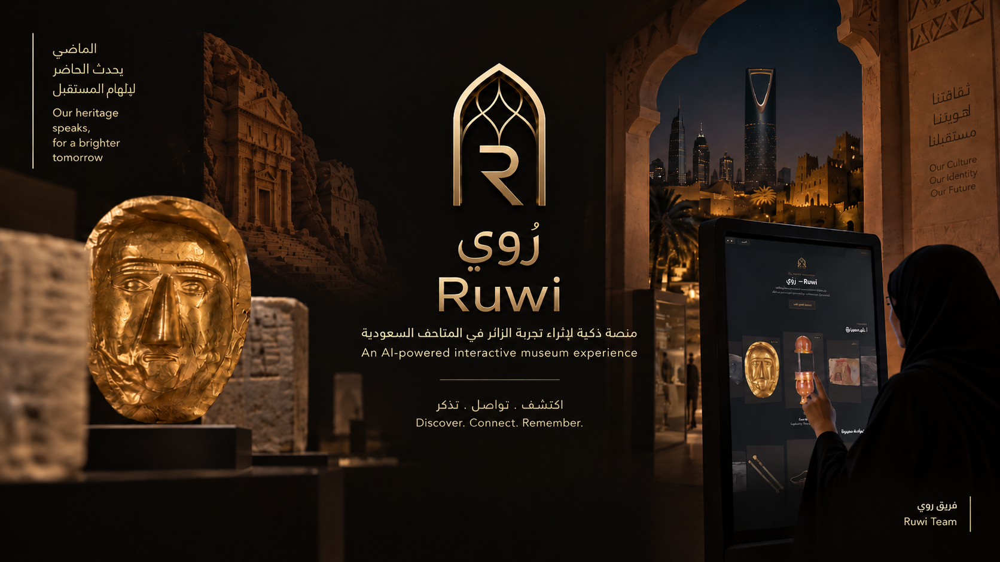
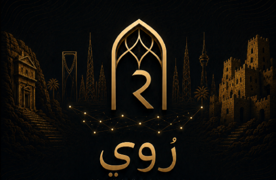
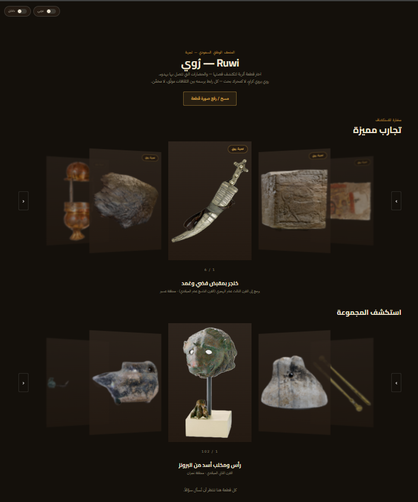
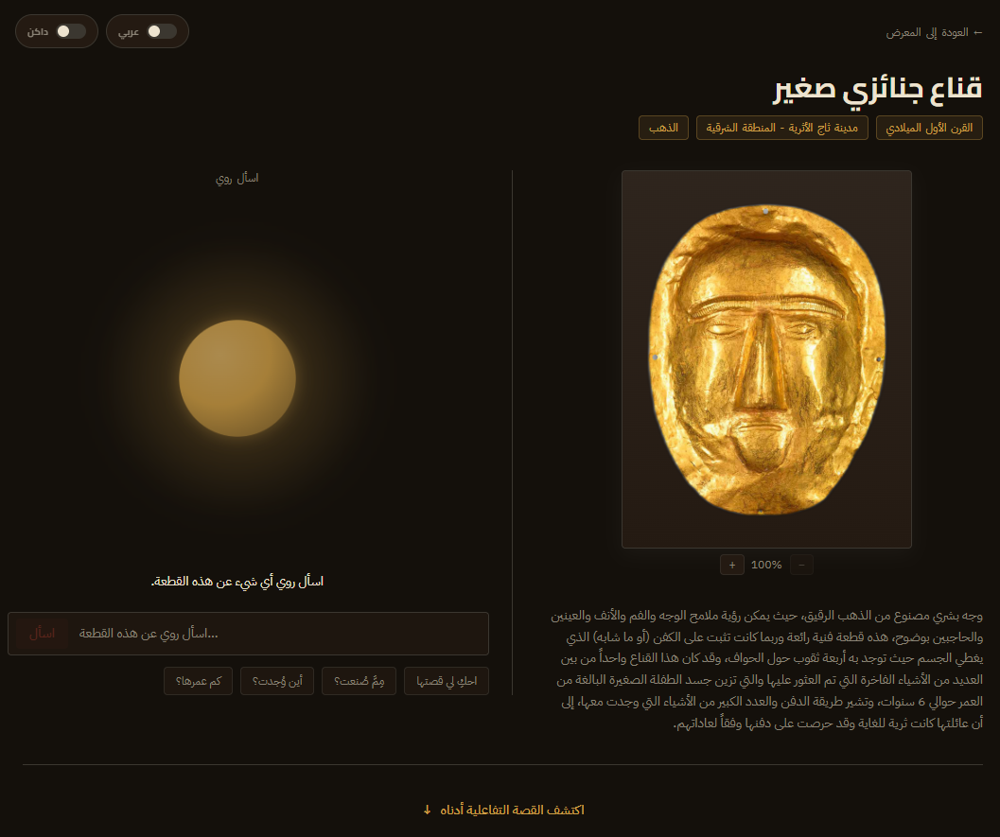
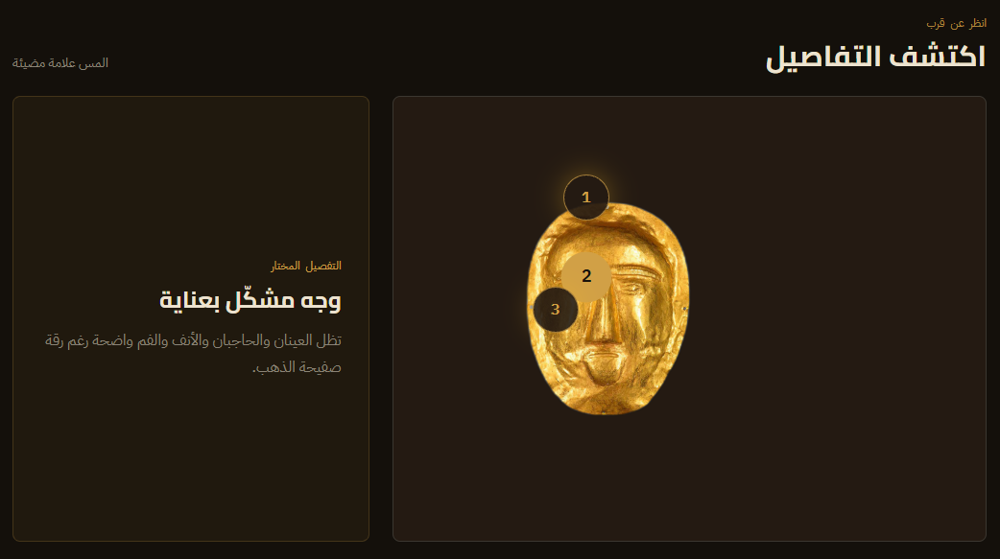
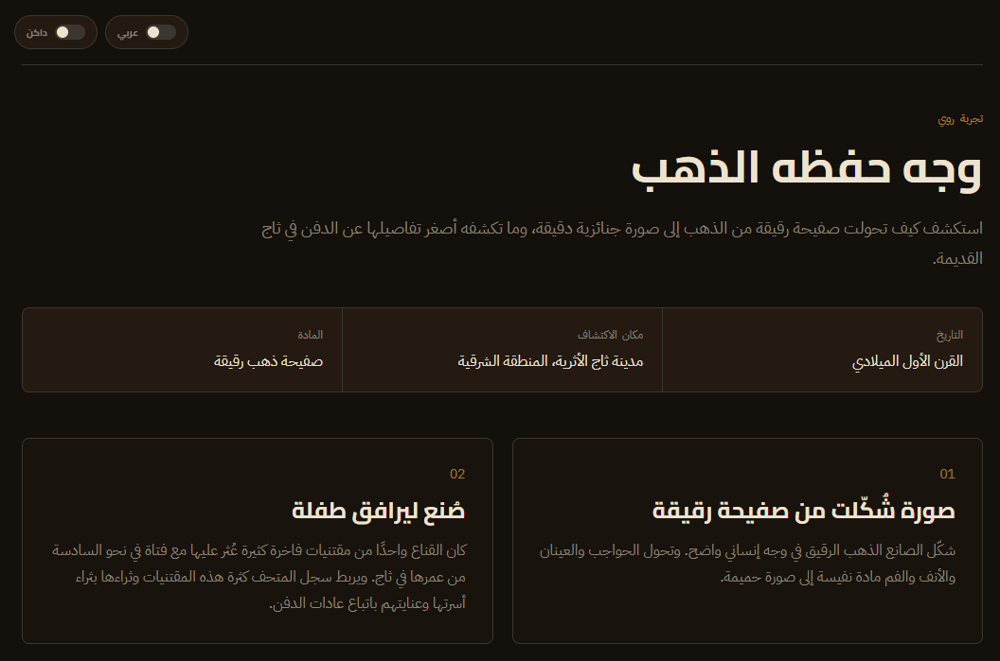
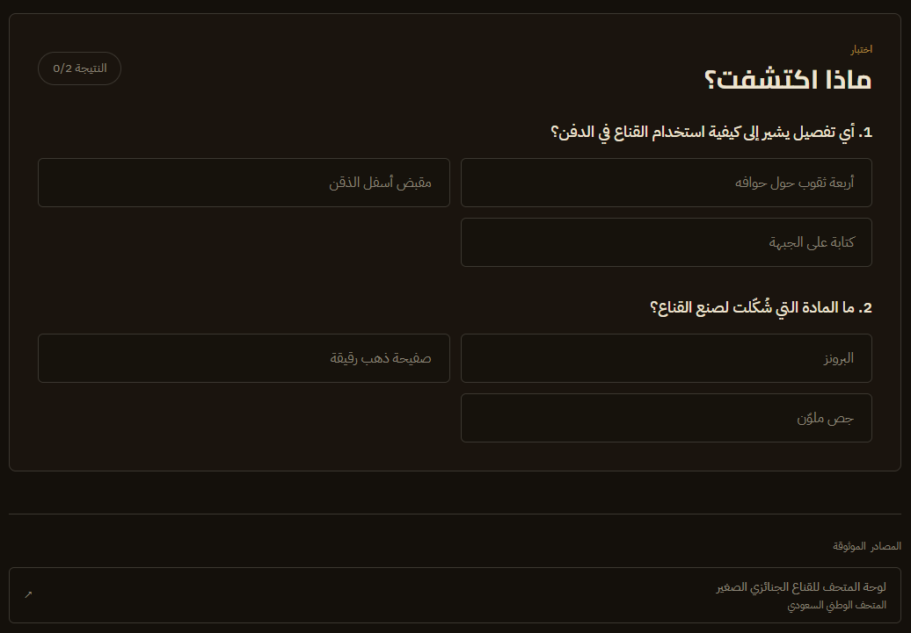
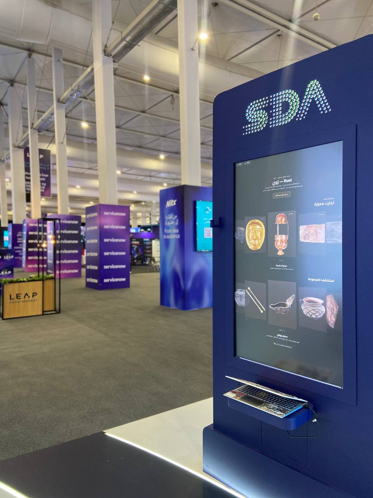
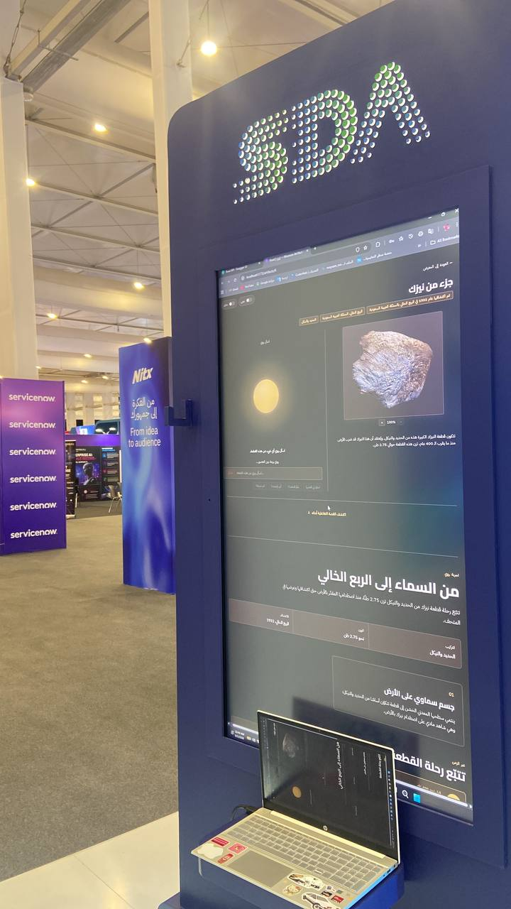

# 🏛️ Ruwi | رُوي

<p align="center">
  
</p>

<p align="center">
  
</p>

<p align="center">
  <strong>Every Artifact Has a Story. Ruwi Brings It to Life.</strong>
</p>

<p align="center">
  An AI-powered interactive museum experience for exploring Saudi cultural heritage.
</p>

---

## 📖 Overview

**Ruwi (رُوي)** is an AI-powered interactive museum experience developed as a working MVP for exploring Saudi cultural heritage.

Ruwi transforms traditional artifact exploration into an interactive digital experience where visitors can discover artifacts, explore curated stories, interact with educational content, identify supported artifacts through image upload, ask questions, and listen to narrated responses.

The platform combines structured museum content with AI-powered interaction, constrained vision identification, conversational narration, interactive experiences, reflection metadata, trusted-source retrieval, and optional voice narration.

The name **Ruwi (رُوي)** is inspired by the Arabic verb **"روى"**, meaning *to narrate* or *to tell a story*.

> **Every artifact has a story. Ruwi brings it to life.**

---

# 📸 Ruwi in Action

The following visuals showcase the main Ruwi experience and selected interactive museum features.

## 🏠 Home Experience

<p align="center">
  
</p>

The Ruwi home experience provides visitors with a simple entry point to explore the museum collection and begin an interactive journey.

---

## 👁️ AI Artifact Identification

<p align="center">
  
</p>

Visitors can upload or capture an artifact image and use the Vision AI experience to identify supported artifacts.

The MVP uses **constrained artifact identification**, meaning the system matches the uploaded image against supported museum artifact candidates rather than attempting unrestricted recognition of every possible object.

---

## 🔍 Explore Its Parts

<p align="center">
  
</p>

The interactive artifact experience allows visitors to explore specific parts and details of an artifact.

---

## 🕰️ Historical Timeline

<p align="center">
  
</p>

The timeline experience presents historical events chronologically to provide additional context around an artifact.

---

## 🧪 Test Resources

<p align="center">
  
</p>

Ruwi includes structured resources that support testing and validation of the interactive museum experience.

---

# 🌍 Ruwi at LEAP 2026

Ruwi was demonstrated as a working prototype at **LEAP 2026**, providing an opportunity to showcase the interactive museum experience and demonstrate the concept in an exhibition environment.

<p align="center">
  
</p>

<p align="center">
  
</p>

The demonstration focused on the visitor experience, interactive artifact exploration, AI-assisted interaction, and the potential of Ruwi as a future museum technology experience.

---

# 🎯 Problem

Traditional museum experiences often depend on static descriptions, labels, or conventional audio guides.

Although these approaches provide valuable information, they can limit:

- Visitor interaction
- Personalization
- Deeper exploration
- Contextual storytelling
- Accessibility of information
- Engagement with historical artifacts

Visitors may see an artifact and read a description, but they do not always have an interactive way to ask questions, explore related information, or experience the story behind the object.

Ruwi addresses this by turning artifact exploration into an **interactive, conversational, and AI-assisted experience**.

---

# 💡 Solution

Ruwi provides visitors with a digital museum companion that connects artifact information, interactive experiences, AI narration, and optional voice interaction.

Visitors can:

- 📚 Browse **102 museum artifacts**
- 🏺 Open detailed artifact information
- 📖 Explore curated artifact stories
- 🕰️ Explore historical timelines
- 🔍 Interact with artifact hotspots
- 🧩 Answer educational quizzes
- 📸 Upload or capture an artifact image
- 👁️ Identify supported artifacts using Vision AI
- 💬 Ask questions about artifacts
- 🤖 Receive AI-generated responses
- 🔊 Listen to narrated responses
- 🌐 Switch between Arabic and English
- 🌙 Switch between light and dark themes
- 📱 Use a touch-friendly museum interface

---

# 🧭 Visitor Journey

The Ruwi visitor journey is designed around a simple and intuitive flow:

```text
Visitor
   │
   ▼
Browse / Capture Artifact
   │
   ├───────────────┐
   ▼               ▼
Artifact Gallery   Image Upload
   │               │
   │               ▼
   │        Vision Identification
   │               │
   └───────┬───────┘
           ▼
    Artifact Context
           │
           ▼
   Curated Experience
           │
    ┌──────┼──────┐
    ▼      ▼      ▼
  Story  Timeline Hotspots
    │      │      │
    └──────┼──────┘
           ▼
          Quiz
           │
           ▼
      AI Narrator
           │
           ▼
    Reflection Layer
           │
           ▼
 Optional Voice Output
```

---

# 🧠 AI Architecture

Ruwi uses several focused AI and interaction components rather than relying on a single feature.

## 1. 👁️ Vision Identification

The Vision component processes an uploaded or captured artifact image and attempts to identify it from the supported museum artifact candidates.

Relevant implementation:

```text
backend/vision/

├── identify.py
├── routes.py
└── schemas.py
```

The current MVP uses **constrained artifact identification** rather than open-ended recognition of every possible museum object.

This keeps the identification flow controlled and aligned with the supported showcase artifacts.

---

## 2. 🤖 AI Narrator

The Narrator is responsible for conversational interaction around the artifact experience.

Relevant implementation:

```text
backend/agents/narrator/

├── narrator.py
├── tools.py
└── test_run.py
```

The narrator can work with artifact context and available tools to produce visitor-facing responses.

The backend also supports configurable AI provider settings.

---

## 3. 🔍 Reflection Layer

Ruwi includes a Reflection component that produces structured reflection metadata around visitor interactions.

Relevant implementation:

```text
backend/agents/reflection/

└── reflection.py
```

The current implementation uses deterministic reflection metadata rather than requiring a second independent LLM call for every interaction.

This keeps the MVP lightweight while maintaining structured interaction information.

---

## 4. 🌐 Trusted-Source Connector

The Connector layer provides controlled access to trusted external information sources when configured.

Relevant implementation:

```text
backend/agents/connector/

├── connector.py
├── tools.py
└── test_run.py
```

The Connector is designed around trusted-domain filtering and controlled retrieval.

External retrieval is optional and can remain unconfigured for a local-first deployment.

---

## 5. 🧾 Visit Records

Ruwi contains a lightweight visit and interaction storage layer.

Relevant implementation:

```text
backend/agents/visit/

├── record.py
└── store.py
```

This provides a foundation for recording visitor interaction information and extending the experience toward more personalized museum journeys.

---

# 🏺 Interactive Museum Experience

Ruwi is not limited to displaying an artifact image and description.

Supported experiences include:

### 📖 Story

Visitors can explore a structured narrative around an artifact.

### 🕰️ Timeline

Historical events can be presented chronologically to provide additional context.

### 🔍 Hotspots

Interactive areas of an artifact can provide focused information about specific parts or details.

### 🧩 Quiz

Visitors can test their understanding through educational questions.

### 📚 Sources

Relevant sources can be displayed as part of the structured experience.

These experiences are rendered through the frontend experience system:

```text
frontend/src/components/experience/

├── ExperienceRenderer.tsx
├── HotspotStory.tsx
├── ObjectAnatomy.tsx
├── QuizPanel.tsx
├── SourceList.tsx
└── StoryTimeline.tsx
```

---

# ⭐ Featured Experiences

Ruwi includes curated showcase experiences built around selected artifacts.

The showcase experience data is stored in:

```text
data/showcase_experiences.json
data/showcase_experiences_ar.json
```

The artifact collection itself is stored in:

```text
data/artifacts.json
```

The current dataset contains:

**102 artifacts**

---

# 🌐 Language Support

Ruwi supports:

- 🇸🇦 Arabic
- 🇬🇧 English

Localization files are maintained in:

```text
frontend/src/i18n/locales/

├── ar.json
└── en.json
```

The interface supports:

- RTL for Arabic
- LTR for English

Language switching is implemented through the frontend language system.

---

# 🔊 AI Voice Narration

Ruwi includes optional voice narration using **ElevenLabs Text-to-Speech**.

Relevant implementation:

```text
backend/tts/

├── list_voices.py
├── speak_text.py
└── test_speak.py
```

The system supports separate Arabic and English voice configuration.

Generated audio can be served from:

```text
backend/static/audio/
```

The frontend provides an interactive audio experience through:

```text
frontend/src/components/TtsCenterpiece/

├── index.tsx
├── PlayControls.tsx
└── PulseVisualizer.tsx
```

### Environment configuration

The root `.env` file can contain:

```env
ELEVENLABS_API_KEY=your_api_key
ELEVENLABS_VOICE_ID_EN=your_english_voice_id
ELEVENLABS_VOICE_ID_AR=your_arabic_voice_id
```

> Never commit your real API key or other secrets to GitHub.

---

# 🛠️ Technology Stack

## Frontend

- React
- TypeScript
- Vite
- CSS
- React-based component architecture
- RTL/LTR localization
- Responsive and touch-friendly interaction

## Backend

- Python
- FastAPI
- Uvicorn
- Structured API routes
- AI agent components
- Vision processing
- Experience generation and validation

## AI

- Configurable LLM provider
- Vision-based artifact identification
- AI Narrator
- Reflection layer
- Trusted-source Connector
- Structured museum experience generation

## Voice

- ElevenLabs Text-to-Speech

## Testing

- Pytest
- Frontend component tests

---

# 📁 Project Structure

```text
Ruwi-AI/
│
├── assets/
│   └── clean_artifacts/
│       ├── 1.png
│       ├── 2.png
│       ├── ...
│       └── 102.png
│
├── backend/
│   ├── agents/
│   │   ├── connector/
│   │   │   ├── connector.py
│   │   │   ├── tools.py
│   │   │   └── test_run.py
│   │   │
│   │   ├── narrator/
│   │   │   ├── narrator.py
│   │   │   ├── tools.py
│   │   │   └── test_run.py
│   │   │
│   │   ├── reflection/
│   │   │   └── reflection.py
│   │   │
│   │   └── visit/
│   │       ├── record.py
│   │       └── store.py
│   │
│   ├── app/
│   │   ├── ai/
│   │   ├── api/
│   │   ├── core/
│   │   ├── db/
│   │   ├── repositories/
│   │   ├── schemas/
│   │   └── services/
│   │
│   ├── experience/
│   │   ├── generator.py
│   │   ├── graph.py
│   │   ├── planner.py
│   │   ├── repository.py
│   │   ├── routes.py
│   │   ├── schemas.py
│   │   ├── state.py
│   │   └── validation.py
│   │
│   ├── vision/
│   │   ├── identify.py
│   │   ├── routes.py
│   │   └── schemas.py
│   │
│   ├── tts/
│   │   ├── list_voices.py
│   │   ├── speak_text.py
│   │   └── test_speak.py
│   │
│   ├── static/
│   │   └── audio/
│   │
│   ├── tests/
│   ├── config.py
│   ├── main.py
│   ├── prompts.py
│   └── requirements.txt
│
├── data/
│   ├── artifacts.json
│   ├── showcase_experiences.json
│   ├── showcase_experiences_ar.json
│   └── test.py
│
├── docs/
│   ├── BOOTH_CHECKLIST.md
│   └── images/
│       ├── Ruwi_Explore_Its_Parts.png
│       ├── Ruwi_Hero_Image.png
│       ├── Ruwi_LEAP_2026_Booth.jpg
│       ├── Ruwi_LEAP_2026_Demo.jpg
│       ├── ruwi_home.png
│       ├── ruwi_logo.png
│       ├── Ruwi_Object_Recognition.png
│       ├── ruwi_test_resources.png
│       └── Ruwi_Timeline.png
│
├── frontend/
│   ├── public/
│   │   └── favicon.svg
│   │
│   ├── src/
│   │   ├── api/
│   │   ├── components/
│   │   ├── hooks/
│   │   ├── i18n/
│   │   ├── pages/
│   │   ├── types/
│   │   ├── utils/
│   │   ├── App.tsx
│   │   ├── index.css
│   │   ├── main.tsx
│   │   └── theme.css
│   │
│   ├── package.json
│   ├── package-lock.json
│   └── vite.config.ts
│
├── scripts/
│   └── author_arabic_fields.py
│
├── .env.example
├── .gitignore
├── AGENTS.md
└── README.md
```

---

# 💻 Requirements

Before running Ruwi locally, make sure the following are installed:

- Python 3.12
- Node.js
- npm
- Git

Backend dependencies:

```text
backend/requirements.txt
```

Frontend dependencies:

```text
frontend/package.json
```

---

# 🚀 Installation

Clone the repository:

```powershell
git clone https://github.com/HOUYOKI/Ruwi-AI.git
cd Ruwi-AI
```

---

# 🔐 Environment Configuration

Create the environment file:

```powershell
Copy-Item .env.example .env
```

Then open `.env` and configure the required values.

Example:

```env
ELEVENLABS_API_KEY=your_api_key
ELEVENLABS_VOICE_ID_EN=your_english_voice_id
ELEVENLABS_VOICE_ID_AR=your_arabic_voice_id
```

If an AI provider is required by your configuration, add the corresponding provider settings defined by the project configuration.

> Do not commit `.env` to GitHub.

---

# 🐍 Backend Setup

Move into the backend directory:

```powershell
cd backend
```

Create a Python virtual environment:

```powershell
python -m venv venv
```

Activate it:

```powershell
.\venv\Scripts\Activate.ps1
```

Install dependencies:

```powershell
python -m pip install -r requirements.txt
```

Start the FastAPI server:

```powershell
uvicorn main:app --host 0.0.0.0 --port 8000
```

Backend:

```text
http://localhost:8000
```

FastAPI documentation:

```text
http://localhost:8000/docs
```

---

# ⚛️ Frontend Setup

Open a second PowerShell window.

Move into the frontend directory:

```powershell
cd frontend
```

Install dependencies:

```powershell
npm install
```

Create the frontend environment file:

```powershell
Set-Content .env 'VITE_API_BASE_URL=http://localhost:8000'
```

Start the Vite development server:

```powershell
npm run dev -- --host 0.0.0.0 --port 5173
```

Frontend:

```text
http://localhost:5173
```

---

# ▶️ Running Ruwi

To run the complete local application, use two terminals.

### Terminal 1 — Backend

```powershell
cd backend
.\venv\Scripts\Activate.ps1
uvicorn main:app --host 0.0.0.0 --port 8000
```

### Terminal 2 — Frontend

```powershell
cd frontend
npm run dev -- --host 0.0.0.0 --port 5173
```

Then open:

```text
http://localhost:5173
```

---

# 🧪 Testing

Backend tests can be executed using:

```powershell
cd backend
pytest
```

The project includes tests covering areas such as:

- Vision identification
- AI experience generation
- Narrator and Connector interaction
- Reflection
- Text-to-Speech
- Visit records
- Configuration
- Booth fallbacks

---

# 🔌 API Overview

The backend exposes structured API routes for the main Ruwi capabilities.

Core areas include:

```text
Artifacts
Vision Identification
Conversational AI
Interactive Experiences
Text-to-Speech
Visit / Interaction Records
```

FastAPI automatically provides interactive API documentation at:

```text
http://localhost:8000/docs
```

---

# 🎨 User Experience

Ruwi is designed for an interactive museum environment.

The interface supports:

- Arabic and English
- RTL and LTR layouts
- Light and dark themes
- Touch-friendly controls
- Artifact browsing
- Artifact details
- Image upload
- AI interaction
- Interactive experiences
- Audio narration

---

# 🏛️ Museum Experience

Ruwi is designed to complement the physical museum environment rather than replace the physical artifact.

The experience can be adapted for:

- Museum touch displays
- Interactive exhibition stations
- Visitor exploration kiosks
- Guided digital experiences
- Educational museum activities

The current project is a working prototype and provides a foundation for future museum pilots and controlled deployment environments.

---

# 🔒 Security & Configuration

The project is designed to keep sensitive configuration outside the source code.

API keys and private configuration values should be stored in `.env`.

Never commit:

```text
.env
API keys
Private credentials
Secrets
```

External information retrieval can remain disabled when a local-first deployment is preferred.

---

# 📌 Current AI Scope

The current MVP focuses on controlled and supported museum experiences.

The Vision component performs constrained artifact identification against supported candidates.

The conversational experience uses the available artifact context and configured AI services.

The platform is therefore designed around **controlled museum content and supported artifact experiences**, rather than unrestricted AI recognition or unrestricted factual generation.

---

# 🚧 Future Development

Potential future development directions include:

- Integration with selected museum environments
- Expansion of supported artifact collections
- Additional interactive experiences
- Improved visitor personalization
- Expanded trusted-source retrieval
- More advanced multilingual narration
- Additional accessibility features
- Museum analytics and interaction insights
- Production deployment
- Integration with approved museum content systems

These represent future development directions and are not presented as current deployments.

---

# 🌱 Deployment Direction

A potential museum deployment pathway could follow a controlled approach:

```text
Prototype
   │
   ▼
Museum / Stakeholder Review
   │
   ▼
Select Pilot Environment
   │
   ▼
Select Approved Artifacts
   │
   ▼
Align Content & Sources
   │
   ▼
Limited Pilot
   │
   ▼
Evaluate Visitor Experience
   │
   ▼
Improve & Validate
   │
   ▼
Potential Scale-Up
```

Any future deployment would require alignment with the relevant museum, content owners, technical requirements, privacy requirements, and approved sources.

---

# 📊 Project Status

**Status: Working Prototype / MVP**

Ruwi has been demonstrated at **LEAP 2026** as an interactive AI-powered museum experience.

The current implementation includes:

- 102 artifacts
- Interactive artifact exploration
- Vision-based artifact identification
- Conversational AI
- Story experiences
- Timelines
- Hotspots
- Educational quizzes
- Arabic and English support
- AI voice narration
- Reflection metadata
- Trusted-source Connector
- Visit interaction storage
- Automated testing

---

# 👥 Team

Ruwi was developed collaboratively by:

- **Abdulaziz Fadul**
- **Maysam Abduljalil**
- **Ohoud Ibn Alshaykh**
- **Nedaa Bajaber**

The team worked collaboratively across the project idea, design, development, AI experience, user interaction, testing, iteration, and presentation.

---

# 🔗 Repository

GitHub:

https://github.com/HOUYOKI/Ruwi-AI

---

<p align="center">
  <strong>Ruwi | رُوي</strong>
  <br>
  Every Artifact Has a Story.
  <br>
  Ruwi Brings It to Life.
</p>
