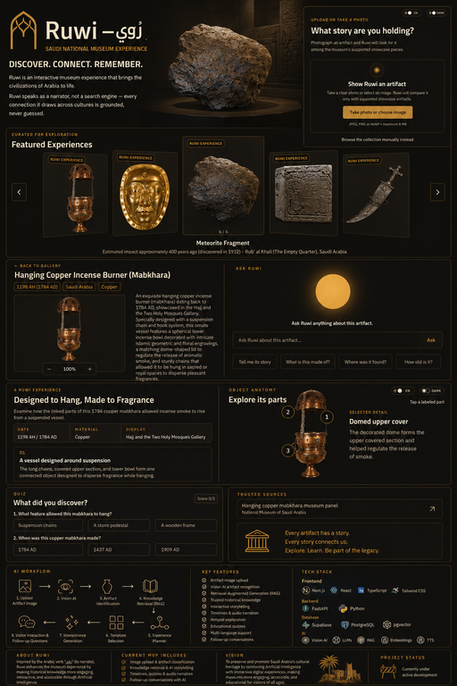

# 🏛️ Ruwi | رُوي

<p align="center">
  
</p>

<p align="center">
  <strong>Every Artifact Has a Story. Ruwi Brings It to Life.</strong>
</p>

<p align="center">
  An AI-powered interactive museum experience for exploring Saudi cultural heritage.
</p>

---

## 📖 Overview

**Ruwi (رُوي)** is an AI-powered interactive museum experience designed as an MVP for the **Saudi National Museum**.

Ruwi transforms traditional artifact exploration into an interactive digital experience where visitors can discover museum artifacts, explore curated stories, interact with educational content, identify supported artifacts through image upload, ask questions, and listen to narrated responses.

The platform combines structured museum content with AI-powered interaction, constrained vision identification, conversational narration, interactive experiences, reflection metadata, trusted-source retrieval, and optional voice narration.

The name **Ruwi (رُوي)** is inspired by the Arabic verb **"روى"**, meaning *to narrate* or *to tell a story*.

> **Every artifact has a story. Ruwi brings it to life.**

---

# 🎯 Problem

Traditional museum experiences often depend on static descriptions, labels, or conventional audio guides.

Although these approaches provide valuable information, they can limit:

- Visitor interaction
- Personalization
- Deeper exploration
- Contextual storytelling
- Accessibility of information
- Engagement with historical artifacts

Visitors may see an artifact and read a description, but they do not always have an interactive way to ask questions, explore related information, or experience the story behind the object.

Ruwi addresses this by turning artifact exploration into an **interactive, conversational, and AI-assisted experience**.

---

# 💡 Solution

Ruwi provides visitors with a digital museum companion that connects artifact information, interactive experiences, AI narration, and optional voice interaction.

Visitors can:

- 📚 Browse **102 museum artifacts**
- 🏺 Open detailed artifact information
- 📖 Explore curated artifact stories
- 🕰️ Explore historical timelines
- 🔍 Interact with artifact hotspots
- 🧩 Answer educational quizzes
- 📸 Upload or capture an artifact image
- 👁️ Identify supported artifacts using Vision AI
- 💬 Ask questions about artifacts
- 🤖 Receive AI-generated responses
- 🔊 Listen to narrated responses
- 🌐 Switch between Arabic and English
- 🌙 Switch between light and dark themes
- 📱 Use a touch-friendly museum interface

---

# ⚙️ How Ruwi Works

The visitor journey is designed around a simple flow:

```text
                    Visitor
                       │
                       ▼
             Browse / Capture Artifact
                       │
              ┌────────┴────────┐
              │                 │
              ▼                 ▼
        Artifact Gallery    Image Upload
              │                 │
              │                 ▼
              │         Vision Identification
              │                 │
              └────────┬────────┘
                       ▼
                Artifact Context
                       │
                       ▼
             Curated Experience
                       │
        ┌──────────────┼──────────────┐
        │              │              │
        ▼              ▼              ▼
      Story         Timeline       Hotspots
        │              │              │
        └──────────────┼──────────────┘
                       │
                       ▼
                     Quiz
                       │
                       ▼
                 AI Narrator
                       │
                       ▼
                Reflection Layer
                       │
                       ▼
              Optional Voice Output
```

---

# 🧠 AI Architecture

Ruwi uses several focused AI and interaction components rather than relying on a single feature.

## 1. 👁️ Vision Identification

The Vision component processes an uploaded or captured artifact image and attempts to identify it from the supported museum artifact candidates.

Relevant implementation:

```text
backend/vision/
├── identify.py
├── routes.py
└── schemas.py
```

The current MVP uses **constrained artifact identification** rather than open-ended recognition of every possible museum object.

This keeps the identification flow controlled and aligned with the supported showcase artifacts.

---

## 2. 🤖 AI Narrator

The Narrator is responsible for conversational interaction around the artifact experience.

Relevant implementation:

```text
backend/agents/narrator/
├── narrator.py
├── tools.py
└── test_run.py
```

The narrator can work with the artifact context and available tools to produce visitor-facing responses.

The project also includes configurable AI provider support through the backend configuration layer.

---

## 3. 🔍 Reflection Layer

Ruwi includes a Reflection component that produces structured reflection metadata around the visitor interaction.

Relevant implementation:

```text
backend/agents/reflection/
└── reflection.py
```

The current implementation uses deterministic reflection metadata rather than requiring a second independent LLM call for every interaction.

This allows the experience to maintain structured interaction information while keeping the MVP lightweight.

---

## 4. 🌐 Connector

The Connector layer provides controlled access to trusted external information sources when configured.

Relevant implementation:

```text
backend/agents/connector/
├── connector.py
├── tools.py
└── test_run.py
```

The Connector is designed around trusted-domain filtering and controlled retrieval.

External retrieval is optional and can remain unconfigured for a local-first deployment.

---

## 5. 🧾 Visit Records

Ruwi contains a lightweight visit/interaction storage layer.

Relevant implementation:

```text
backend/agents/visit/
├── record.py
└── store.py
```

This provides a foundation for recording visitor interaction information and extending the experience toward more personalized museum journeys.

---

# 🏺 Interactive Museum Experience

Ruwi is not limited to displaying an artifact image and description.

Supported experiences include:

### 📖 Story

Visitors can explore a structured narrative around an artifact.

### 🕰️ Timeline

Historical events can be presented chronologically to provide additional context.

### 🔍 Hotspots

Interactive areas of an artifact can provide focused information about specific parts or details.

### 🧩 Quiz

Visitors can test their understanding through educational questions.

### 📚 Sources

Relevant sources can be displayed as part of the structured experience.

These experiences are rendered through the frontend experience system:

```text
frontend/src/components/experience/
├── ExperienceRenderer.tsx
├── HotspotStory.tsx
├── ObjectAnatomy.tsx
├── QuizPanel.tsx
├── SourceList.tsx
└── StoryTimeline.tsx
```

---

# ⭐ Featured Experiences

Ruwi currently includes a set of curated showcase experiences built around selected artifacts.

The showcase experience data is stored in:

```text
data/showcase_experiences.json
data/showcase_experiences_ar.json
```

The artifact collection itself is stored in:

```text
data/artifacts.json
```

The current dataset contains **102 artifacts**.

---

# 🌐 Language Support

Ruwi supports:

- 🇸🇦 Arabic
- 🇬🇧 English

Localization files are maintained in:

```text
frontend/src/i18n/locales/
├── ar.json
└── en.json
```

The interface supports both:

- RTL for Arabic
- LTR for English

Language switching is implemented through the frontend language system.

---

# 🔊 Text-to-Speech

Ruwi includes optional voice narration using **ElevenLabs**.

Relevant implementation:

```text
backend/tts/
├── list_voices.py
├── speak_text.py
└── test_speak.py
```

The system supports separate Arabic and English voice configuration.

Generated audio can be served from:

```text
backend/static/audio/
```

The frontend provides an interactive audio experience through:

```text
frontend/src/components/TtsCenterpiece/
├── index.tsx
├── PlayControls.tsx
└── PulseVisualizer.tsx
```

### Environment configuration

The root `.env` file can contain the required ElevenLabs configuration:

```env
ELEVENLABS_API_KEY=your_api_key
ELEVENLABS_VOICE_ID_EN=your_english_voice_id
ELEVENLABS_VOICE_ID_AR=your_arabic_voice_id
```

> Never commit your real API key or other secrets to GitHub.

---

# 🛠️ Technology Stack

## Frontend

- React
- TypeScript
- Vite
- CSS
- React-based component architecture
- RTL/LTR localization
- Responsive and touch-friendly interaction

## Backend

- Python
- FastAPI
- Uvicorn
- Structured API routes
- AI agent components
- Vision processing
- Experience generation and validation

## AI

- Configurable LLM provider
- Vision-based artifact identification
- AI Narrator
- Reflection layer
- Trusted-source Connector
- Structured museum experience generation

## Voice

- ElevenLabs Text-to-Speech

## Testing

- Pytest
- Frontend component tests

---

# 📁 Project Structure

```text
Ruwi-AI/
│
├── assets/
│   └── clean_artifacts/
│       ├── 1.png
│       ├── 2.png
│       ├── ...
│       └── 102.png
│
├── backend/
│   │
│   ├── agents/
│   │   ├── connector/
│   │   │   ├── connector.py
│   │   │   ├── tools.py
│   │   │   └── test_run.py
│   │   │
│   │   ├── narrator/
│   │   │   ├── narrator.py
│   │   │   ├── tools.py
│   │   │   └── test_run.py
│   │   │
│   │   ├── reflection/
│   │   │   └── reflection.py
│   │   │
│   │   └── visit/
│   │       ├── record.py
│   │       └── store.py
│   │
│   ├── app/
│   │   ├── ai/
│   │   ├── api/
│   │   ├── core/
│   │   ├── db/
│   │   ├── repositories/
│   │   ├── schemas/
│   │   └── services/
│   │
│   ├── experience/
│   │   ├── generator.py
│   │   ├── graph.py
│   │   ├── planner.py
│   │   ├── repository.py
│   │   ├── routes.py
│   │   ├── schemas.py
│   │   ├── state.py
│   │   └── validation.py
│   │
│   ├── vision/
│   │   ├── identify.py
│   │   ├── routes.py
│   │   └── schemas.py
│   │
│   ├── tts/
│   │   ├── list_voices.py
│   │   ├── speak_text.py
│   │   └── test_speak.py
│   │
│   ├── static/
│   │   └── audio/
│   │
│   ├── tests/
│   │   ├── test_booth_fallbacks.py
│   │   ├── test_config.py
│   │   ├── test_connector.py
│   │   ├── test_experience.py
│   │   ├── test_narrator_connector.py
│   │   ├── test_reflection.py
│   │   ├── test_tts.py
│   │   ├── test_vision.py
│   │   ├── test_visit_record.py
│   │   └── test_visit_store.py
│   │
│   ├── config.py
│   ├── main.py
│   ├── prompts.py
│   └── requirements.txt
│
├── data/
│   ├── artifacts.json
│   ├── showcase_experiences.json
│   ├── showcase_experiences_ar.json
│   └── test.py
│
├── docs/
│   ├── BOOTH_CHECKLIST.md
│   └── images/
│       └── ruwi-overview.webp
│
├── frontend/
│   │
│   ├── public/
│   │   └── favicon.svg
│   │
│   ├── src/
│   │   ├── api/
│   │   │   ├── apiClient.ts
│   │   │   ├── artifactApi.ts
│   │   │   └── chatApi.ts
│   │   │
│   │   ├── components/
│   │   │   ├── ArtifactCard.tsx
│   │   │   ├── ArtifactDetail.tsx
│   │   │   ├── ArtifactGrid.tsx
│   │   │   ├── ArtifactImageViewer.tsx
│   │   │   ├── ArtifactUpload.tsx
│   │   │   ├── LanguageToggle.tsx
│   │   │   ├── QuestionComposer.tsx
│   │   │   ├── StatusView.tsx
│   │   │   ├── ThemeToggle.tsx
│   │   │   │
│   │   │   ├── ArtifactCarousel/
│   │   │   ├── ChatPanel/
│   │   │   ├── experience/
│   │   │   └── TtsCenterpiece/
│   │   │
│   │   ├── hooks/
│   │   ├── i18n/
│   │   ├── pages/
│   │   │   ├── ArtifactPage.tsx
│   │   │   ├── GalleryPage.tsx
│   │   │   └── IdentifyPage.tsx
│   │   │
│   │   ├── types/
│   │   ├── utils/
│   │   ├── App.tsx
│   │   ├── index.css
│   │   ├── main.tsx
│   │   └── theme.css
│   │
│   ├── package.json
│   ├── package-lock.json
│   └── vite.config.ts
│
├── scripts/
│   └── author_arabic_fields.py
│
├── .env.example
├── .gitignore
├── AGENTS.md
└── README.md
```

---

# 💻 Requirements

Before running Ruwi locally, make sure the following are installed:

- Python 3.12
- Node.js
- npm
- Git

The backend dependencies are defined in:

```text
backend/requirements.txt
```

The frontend dependencies are defined in:

```text
frontend/package.json
```

---

# 🚀 Installation

Clone the repository:

```powershell
git clone https://github.com/HOUYOKI/Ruwi-AI.git
cd Ruwi-AI
```

---

# 🔐 Environment Configuration

Create the environment file from the provided example:

```powershell
Copy-Item .env.example .env
```

Then open `.env` and configure the required values.

Example:

```env
ELEVENLABS_API_KEY=your_api_key
ELEVENLABS_VOICE_ID_EN=your_english_voice_id
ELEVENLABS_VOICE_ID_AR=your_arabic_voice_id
```

If an AI provider is required by your configuration, add the corresponding provider settings defined by the project configuration.

> Do not commit `.env` to GitHub.

---

# 🐍 Backend Setup

Move into the backend directory:

```powershell
cd backend
```

Create a Python virtual environment:

```powershell
python -m venv venv
```

Activate it:

```powershell
.\venv\Scripts\Activate.ps1
```

Install dependencies:

```powershell
python -m pip install -r requirements.txt
```

Start the FastAPI server:

```powershell
uvicorn main:app --host 0.0.0.0 --port 8000
```

The backend will be available at:

```text
http://localhost:8000
```

FastAPI documentation is available at:

```text
http://localhost:8000/docs
```

---

# ⚛️ Frontend Setup

Open a second PowerShell window.

Move into the frontend directory:

```powershell
cd frontend
```

Install dependencies:

```powershell
npm install
```

Create the frontend environment file:

```powershell
Set-Content .env 'VITE_API_BASE_URL=http://localhost:8000'
```

Start the Vite development server:

```powershell
npm run dev -- --host 0.0.0.0 --port 5173
```

The frontend will normally be available at:

```text
http://localhost:5173
```

---

# ▶️ Running Ruwi

To run the complete local application, use two terminals.

### Terminal 1 — Backend

```powershell
cd backend
.\venv\Scripts\Activate.ps1
uvicorn main:app --host 0.0.0.0 --port 8000
```

### Terminal 2 — Frontend

```powershell
cd frontend
npm run dev -- --host 0.0.0.0 --port 5173
```

Then open:

```text
http://localhost:5173
```

---

# 🧪 Testing

## Backend Tests

From the `backend` directory:

```powershell
.\venv\Scripts\python.exe -m unittest discover -s tests -v
```

The backend test suite covers areas including:

- Configuration
- Connector
- Experience generation
- Narrator/Connector interaction
- Reflection
- Text-to-Speech
- Vision identification
- Visit records
- Visit storage
- Booth fallbacks

---

## Backend Compilation Check

To check Python compilation:

```powershell
.\venv\Scripts\python.exe -m compileall -q -x "venv" .
```

---

## Frontend Tests

From the `frontend` directory:

```powershell
npm test -- --run
```

---

## Frontend Build

Create a production build:

```powershell
npm run build
```

---

## Frontend Lint

Run the frontend linter:

```powershell
npm run lint
```

---

# 🔌 API

The backend exposes API functionality for artifacts, experiences, identification, chat, configuration, and audio.

Important routes include:

| Method | Endpoint | Purpose |
|---|---|---|
| GET | `/artifacts?lang=en` | Retrieve the artifact collection |
| GET | `/artifacts?lang=ar` | Retrieve the Arabic artifact collection |
| GET | `/artifacts/{id}?lang=en` | Retrieve an artifact |
| GET | `/artifacts/{id}/experience?lang=en` | Retrieve an artifact experience |
| GET | `/images/{id}.png` | Retrieve an artifact image |
| POST | `/identify` | Identify a supported artifact from an uploaded image |
| POST | `/chat` | Send a conversational request |
| GET | `/health/config` | Check backend configuration |
| GET | `/static/audio/{filename}.mp3` | Serve generated narration audio |

API documentation can be explored through FastAPI Swagger:

```text
http://localhost:8000/docs
```

---

# 📸 Artifact Identification

The identification interface is available through:

```text
frontend/src/pages/IdentifyPage.tsx
```

The backend implementation is located in:

```text
backend/vision/
```

The visitor can upload or capture an artifact image.

The system then processes the image and attempts to match it against the currently supported artifact candidates.

The current MVP intentionally uses **constrained identification** rather than claiming universal museum-object recognition.

---

# 💬 Conversational Experience

The frontend chat functionality is implemented through:

```text
frontend/src/components/ChatPanel/
```

with API communication handled through:

```text
frontend/src/api/chatApi.ts
```

The backend exposes the conversational endpoint:

```text
POST /chat
```

The conversation can use available artifact context and the configured AI components to produce an interactive response.

---

# 🧩 Experience Generation

The backend experience system is located in:

```text
backend/experience/
```

It includes:

- Experience generator
- Experience planner
- Graph workflow
- Repository
- State management
- Schemas
- Validation
- Routes

The experience renderer on the frontend converts the structured experience into interactive UI elements such as:

- Story
- Timeline
- Hotspots
- Quiz
- Sources

---

# 🎨 User Interface

Ruwi is designed for an interactive museum environment.

The interface includes:

- Artifact gallery
- Artifact detail views
- Image viewer
- Image identification
- Conversational chat
- Interactive experiences
- Language switching
- Theme switching
- Audio narration
- Touch-friendly interactions

Main frontend pages:

```text
GalleryPage
ArtifactPage
IdentifyPage
```

---

# 🌙 Theme Support

Ruwi provides both:

- Light mode
- Dark mode

Theme logic is implemented through:

```text
frontend/src/hooks/useTheme.ts
frontend/src/components/ThemeToggle.tsx
```

---

# 📱 Touch Interaction

The frontend contains interaction utilities designed for touch-based museum interfaces, including:

```text
useDragSwipe.ts
useCarouselNavigation.ts
useCroppedArtifactImage.ts
```

This supports a more natural interaction model for touchscreen installations.

---

# 🏛️ Museum Booth Readiness

A dedicated booth checklist is available at:

```text
docs/BOOTH_CHECKLIST.md
```

This can be used to validate the application before a physical museum or exhibition deployment.

Before a live booth deployment, verify:

- Backend availability
- Frontend availability
- Network connectivity
- AI provider configuration
- ElevenLabs configuration
- Audio playback
- Artifact images
- Arabic interface
- English interface
- Image identification
- Chat interaction
- Touch interactions
- Display resolution
- Browser configuration

---

# 🔒 Security Notes

Ruwi uses environment variables for sensitive configuration.

Never commit:

```text
.env
```

or any file containing:

- API keys
- Access tokens
- Private credentials
- Secret configuration

Use:

```text
.env.example
```

as the safe template for required configuration.

---

# 📌 Current AI Scope

The current version of Ruwi is an **MVP**, and its AI capabilities are intentionally scoped.

### Currently implemented

- AI-powered conversational narration
- Structured artifact context
- Curated interactive experiences
- Constrained image identification
- Reflection metadata
- Trusted-source Connector architecture
- Optional ElevenLabs narration
- Arabic and English interaction
- Experience planning and validation

### Current limitations

The current MVP does not claim:

- Universal artifact recognition
- Unlimited open-domain visual recognition
- A fully autonomous museum knowledge system
- Guaranteed live external retrieval without provider configuration
- Fully open-ended artifact discovery beyond the supported dataset

These boundaries keep the current experience controlled, predictable, and suitable for an MVP demonstration.

---

# 🔮 Future Development

Potential future extensions include:

- Expanded museum artifact recognition
- Larger museum knowledge sources
- Advanced semantic retrieval
- Vector-based RAG
- More personalized visitor journeys
- Visitor profiles and long-term preferences
- Additional museum collections
- More interactive 3D artifact experiences
- Advanced multilingual narration
- Analytics dashboards
- Cloud deployment
- Production authentication
- Museum staff administration tools
- Deeper integration with museum digital infrastructure

---

# 🏗️ Deployment Direction

The current repository is structured for local development and demonstration.

A production deployment can separate the system into:

```text
                    ┌─────────────────────┐
                    │   Museum Interface  │
                    │ React / TypeScript  │
                    └──────────┬──────────┘
                               │
                               ▼
                    ┌─────────────────────┐
                    │      FastAPI        │
                    │      Backend        │
                    └──────────┬──────────┘
                               │
             ┌─────────────────┼─────────────────┐
             │                 │                 │
             ▼                 ▼                 ▼
       AI / Narrator       Vision          Experience
             │                 │                 │
             └─────────────────┼─────────────────┘
                               │
                               ▼
                    Museum Knowledge Layer
                               │
                               ▼
                       Optional TTS
```

---

# 📊 Project Status

| Area | Status |
|---|---|
| Museum artifact dataset | ✅ Implemented |
| 102 artifacts | ✅ Implemented |
| Artifact gallery | ✅ Implemented |
| Artifact details | ✅ Implemented |
| Interactive experiences | ✅ Implemented |
| Story | ✅ Implemented |
| Timeline | ✅ Implemented |
| Hotspots | ✅ Implemented |
| Quiz | ✅ Implemented |
| Arabic | ✅ Implemented |
| English | ✅ Implemented |
| Light / Dark theme | ✅ Implemented |
| Image identification | ✅ Implemented — constrained scope |
| AI Narrator | ✅ Implemented |
| Reflection layer | ✅ Implemented |
| Connector architecture | ✅ Implemented |
| ElevenLabs TTS | ✅ Implemented |
| Backend tests | ✅ Implemented |
| Frontend tests | ✅ Implemented |
| Production deployment | 🔄 Future |
| Open-ended visual recognition | 🔄 Future |
| Advanced vector RAG | 🔄 Future |

---

# 👥 Team

## Ruwi | رُوي

Built by:

- **Maysam Abduljalil**
- **Abdulaziz Fadul**
- **Ohoud Ibn Alshaykh**
- **Nedaa Bajaber**

### Saudi National Museum Interactive Experience

Ruwi was created as a collaborative project focused on combining **AI, interactive technology, and Saudi cultural heritage** to create a more engaging museum experience.

---

# 📚 Repository

**GitHub Repository**

```text
https://github.com/HOUYOKI/Ruwi-AI
```

---

# ❤️ Ruwi

> **Every artifact has a story. Ruwi brings it to life.**

Ruwi aims to bridge the gap between cultural heritage and emerging technology by giving visitors a more interactive way to discover, understand, and connect with Saudi history.

---